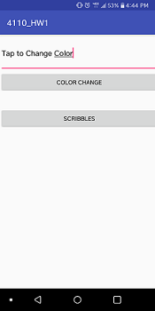
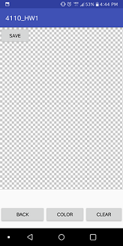
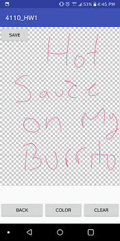
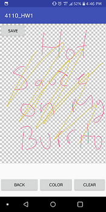
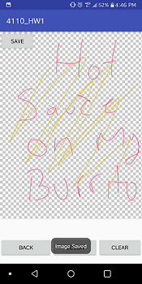

# 4110_HW1
First project of CEG 4110

## Random colors and drawing

This application is my first attempt at the first homework for CEG 4110 at Wright State University. This project was meant to give the students a nice introductory lesson in working with a
mobile development environment. Additionally, this homework was to prepare the students for the semester long group project. The application is broken down into 2 parts. The first part
is an activity that allows users to enter specific text and change the color of that text to a random color. The second activity allows users to draw images on their screen in the color of their choice.
Additionally, the user can clear the drawing screen and save the drawing in their phone.  


## MainActivity (Activity 1: Text entry with random color change)

MainActivity is the initial driver program for this project




Users can input any specific text in the text area in the top of the screen, selecting "COLOR CHANGE" will change the color of the text to a randomly generated color. Underneath the "CHANGE COLOR" button, the new RGB and hex values will display what random color was generated

The random color is generated by the <b>chooseColor()</b>, which creates an int array and String array both of length 3. Inside <b>chooseColor()</b>, a random number is generated 3 times and put into the int array, these will become our R, G, and B values. The hexidecimal String is created by calling <b>Integer.toHexString()</b>, where the integers are cast into hex values. These hex values are then put into a single string

The creation of the displayed color values are set by calling <b>changeColorText(int[] colors2, String hexNum)</b>. This creates the string of RGB values by utilizing <b>Integer.toString()</b>, it then sets the TextView to the values created in changeColorText.

To change activities to drawing, selecting the "Scribbles" button will create <b>Intent intent = new Intent(this, Main3Activity.class);</b> and <b>startActivity(intent)</b> to transition into the second activity.


## Main3Activity (Activity 2: Drawing on screen)

Main3Activity is the second activity of the application that allows users to draw on the screen, change the color of the drawing, clear the drawing, and save the drawing. 

The drawing canvas implements a pre-existing library from https://github.com/ByoxCode/DrawView which allows users to draw on the screen. The screen is portioned off so that approximately 3/4 of the screen can be drawn on, the rest of the screen contains the buttons for manipulating the draw view. Instructions on how to include the library will be included below.




### Color Button

When a user presses the "COLOR" button, <b>OpenColorPicker(boolean)</b> is called. The color picker was utilized from another github library https://github.com/yukuku/ambilwarna, the library allows users to pick a color from a color palette. When the user selects the "OK" button on the color pallete, the variable DefaultColor is set to the color that the user has chosen. That DefaultColor is then set as the draw color via <b>mDrawView.setDrawColor(color)</b>. This color will be displayed when the user draws on the drawview.




### Save Button
Don't forget to save your drawing to show all of your friends! To save as a .png image simply select the "SAVE" button. When the "SAVE" button is selected, it converts the drawview into a bitmap and saves that into an Object List. A filename is then created and passed into a fileoutputstream. The bitmap is then saved using bmp.compress(Bitmap.CompressFormat.PNG, 100, fOut);. If the file save was successful, a message box will populate "File Saved" at the bottom of the screen.


#### Variables from saving
- bmp = Bitmap from screen capture
- Bitmap.CompressFormat.PNG = Compresses the bitmap into a .png format
- 100 = Quality of the image
- fOut = filestreamoutput derived from the new file path



### Clear Button

If a user wants to erase their drawing they can select the "CLEAR" button and it will erase whatever has been drawn on the screen. The clearing of the screen is done via a built in function in the DrawView library. When the button is selected, it calls the function <b>clearIt()</b> which erases the screen by calling <b>mDrawView.restartDrawing();</b>. 


### Dependencies

There are 2 external resources that are mandatory for this application to be successful.
    
    
```
dependencies {
    ...
implementation 'com.byox.drawview:drawview:1.3.1'
implementation 'com.github.yukuku:ambilwarna:2.0.1'
}
```
